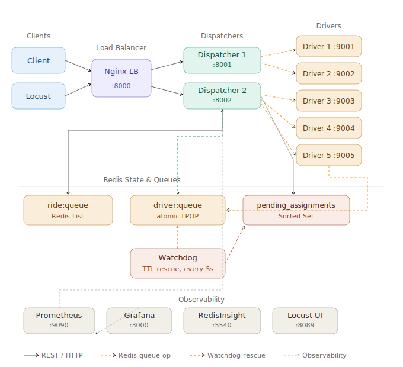

# Distributed Ride-Request Simulation Platform
ENGR 5710G — Network Computing (Winter 2026)



---

## Prerequisites

Install the following before anything else:

**1. Docker**
- Install Docker for Linux:
```bash
curl -fsSL https://get.docker.com | sh
sudo usermod -aG docker $USER
newgrp docker
```
- Verify:
```bash
docker --version
docker compose version
```

**2. Python 3.11+**
```bash
python3 --version
```
If not installed (Ubuntu/WSL2):
```bash
sudo apt update
sudo apt install python3 python3.12-venv python3-pip -y
```

---

## Installation & Setup

### Step 1 — Clone or extract the project
```bash
cd ~
unzip rideshare.zip        # or wherever you extracted the code
cd rideshare
```

### Step 2 — Fix port conflict (if Redis is already running locally)
If you already have Redis running on port 6379 (common on dev machines), edit `docker-compose.yml` and change:
```yaml
redis:
  ports:
    - "6379:6379"
```
To:
```yaml
redis:
  ports:
    - "6380:6379"
```

### Step 3 — Start all services
```bash
docker compose up --build
```

This builds and starts all 11 containers:

| Container | Role | Port |
|---|---|---|
| nginx | Load balancer entry point | 8000 |
| dispatcher1 | Ride dispatcher instance 1 | 8001 |
| dispatcher2 | Ride dispatcher instance 2 | 8002 |
| driver1–5 | Driver nodes | 9001–9005 |
| watchdog | Stale assignment rescue | — |
| redis | Message queues + state | 6380 |
| prometheus | Metrics collection | 9090 |
| grafana | Metrics dashboard | 3000 |
| redisinsight | Redis queue inspector | 5540 |

### Step 4 — Wait for a few second for the system to start (~10 seconds)
Watch the logs.

### Step 5 — Verify everything is running
```bash
curl http://localhost:8001/health
```
Expected response:
```json
{   
    "dispatcher_id":"dispatcher-1",
    "status":"ok",
    "ride_queue_depth":0,
    "available_drivers":5,
    "pending_assignments":0,
    "timestamp":"2026-03-29T17:51:11.000053+00:00"
}
```

---

## Running the Client Simulator

Open a **second terminal** and run:

```bash
cd ~/rideshare/client

# Create virtual environment (first time only)
python3 -m venv venv

# Activate virtual environment
source venv/bin/activate

# Install dependencies (first time only)
pip install -r requirements.txt

# Run simulation — 20 rides, 5 concurrent
python3 main.py --rides 20 --concurrency 5
```

Expected output:
```
============================================================
  Ride-Request Simulation
  Rides: 20  |  Concurrency: 5
============================================================
  [ride-001]  assigned    driver=driver-2    0.6s
  [ride-002]  assigned    driver=driver-1    0.7s
  ...
  Total simulation time : 7.87s
  Throughput            : 2.5 rides/s
============================================================
```

**Client options:**
```bash
python3 main.py --rides 50 --concurrency 10   # heavier load
python3 main.py --help                         # see all options
```

---

## Running Locust Load Testing

```bash
cd ~/rideshare/client
source venv/bin/activate
pip install locust       # first time only

locust -f locustfile.py --host=http://localhost:8000
```

Open in browser: `http://localhost:8089`
- Set number of users: 10
- Set spawn rate: 2
- Click **Start**

---

## Observability Dashboards

Open these in your browser while the system is running:

| Tool | URL | Login |
|---|---|---|
| Grafana | http://localhost:3000 | admin / admin |
| Prometheus | http://localhost:9090 | — |
| RedisInsight | http://localhost:5540 | — |
| Locust UI | http://localhost:8089 | — |

**Grafana setup (first time):**
1. Connections → Data sources → Add → Prometheus
2. URL: `http://prometheus:9090`
3. Save & test

**RedisInsight setup (first time):**
1. Add database → Host: `redis`, Port: `6379`
2. Browse tab shows all queues live

---

## Failure Scenario Demos

Run these while Locust is running to observe system behaviour live.

### Demo 1 — Dispatcher crash + automatic recovery
```bash
# Kill one dispatcher — Nginx auto-routes to the other, zero client failures
docker compose stop dispatcher1

# Bring it back
docker compose start dispatcher1
```
**What to observe:** Locust graph shows zero failures during dispatcher1 being down.

### Demo 2 — Driver goes offline
```bash
docker compose stop driver1

# Bring it back
docker compose start driver1
```
**What to observe:** Dispatcher logs show `driver unreachable`, moves to next driver.

### Demo 3 — Driver timeout
```bash
curl -X POST http://localhost:9002/simulate/slow
```
**What to observe:** Next ride assigned to driver2 triggers a 5s timeout in dispatcher logs.

### Demo 4 — Queue overload
```bash
# Stop all drivers first
docker compose stop driver1 driver2 driver3 driver4 driver5

# Flood the queue
curl -X POST "http://localhost:8000/simulate/overload?count=20" \
  -H "X-API-Key: client-secret"

# Watch queue fill in RedisInsight, then drain after restarting drivers
docker compose start driver1 driver2 driver3 driver4 driver5
```

### Demo 5 — Rate limiting
Lower the limit in `docker-compose.yml` for both dispatchers:
```yaml
- RATE_LIMIT_REQUESTS=5
```
Rebuild: `docker compose up --build`
Run Locust with high concurrency.

### Demo 6 — Watchdog rescue
```bash
docker compose logs -f watchdog
# Kill a dispatcher mid-assignment
docker compose stop dispatcher1
# Watch watchdog rescue stuck drivers after 15s
```

---

## Security

All client ride requests require an API key header:
```bash
curl -X POST http://localhost:8000/rides \
  -H "Content-Type: application/json" \
  -H "X-API-Key: client-secret" \
  -d '{"pickup": "Airport", "dropoff": "Hotel"}'
```

| Scenario | Response |
|---|---|
| Missing API key | 401 Unauthorized |
| Wrong API key | 401 Unauthorized |
| Valid key, valid body | 202 Accepted |
| Valid key, bad body | 422 Unprocessable Entity |

---

## Environment Variables

All configurable via `docker-compose.yml` — no code changes needed.

| Variable | Default | Description |
|---|---|---|
| DRIVER_SECRET | supersecret | Shared token for driver registration |
| RATE_LIMIT_REQUESTS | 1000 | Max requests per IP per window |
| RATE_LIMIT_WINDOW | 60 | Rate limit window in seconds |
| ASSIGN_TIMEOUT | 5.0 | Driver HTTP timeout in seconds |
| MAX_RETRIES | 3 | Max driver assignment attempts per ride |
| REJECTION_RATE | 0.2 | Driver rejection probability (0–1) |
| STALE_THRESHOLD_SECONDS | 15 | Watchdog stale assignment cutoff |

---

## Project Structure

```
/
├── docker-compose.yml       # All services defined here
├── nginx.conf               # Load balancer config
├── prometheus.yml           # Metrics scraping config
├── architecture.svg         # System architecture diagram
├── dispatcher/
│   ├── main.py              # Core dispatcher logic + API
│   ├── requirements.txt
│   └── Dockerfile
├── driver/
│   ├── main.py              # Driver node + /assign endpoint
│   ├── requirements.txt
│   └── Dockerfile
├── watchdog/
│   ├── main.py              # TTL rescue loop
│   ├── requirements.txt
│   └── Dockerfile
└── client/
    ├── main.py              # Async client simulator + metrics
    ├── locustfile.py        # Locust load test config
    └── requirements.txt
```

---

## Stopping the System

```bash
# Stop all containers
docker compose down
```